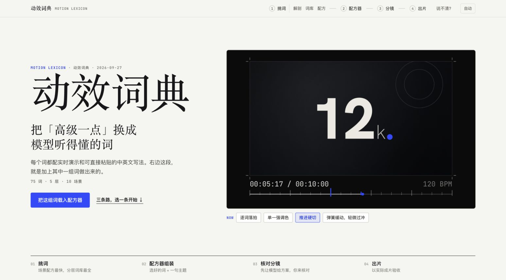

# 动效词典

**看懂效果，找到说法，组合成提示词。**

75 个动效关键词，每个都有实时演示；10 套场景配方，把词组合成可观察的效果。选好词，填入你的内容，再用配方器组装中英文提示词，交给 Claude 或其他支持代码动效的 AI 工具制作。

## 视频预览

### 完整介绍 · 76 秒

从「动效该怎么描述」开始，了解滚动解剖、分层词库、场景配方和提示词配方器。

https://github.com/user-attachments/assets/816429ee-01e4-4850-bee6-7c849bb97648

### 快速预览 · 60 秒

快速浏览四步流程、词条演示与提示词组装。

https://github.com/user-attachments/assets/5809f1a7-8406-4f80-a070-2149b7f689d9

两段视频均保留原配乐。点击播放器开始观看，需要声音时开启播放器的声音。



## 怎么用

1. **打开词典：**点击 [下载完整 ZIP](https://github.com/jinhanbuilds/motion-lexicon/archive/refs/heads/main.zip)，解压后用 Chrome 打开根目录的 `index.html`。
2. **挑一条路：**第一次来可看「滚动解剖」；想自己挑词就进「分层词库」；想快速开始就选「场景配方」。三条路都通向同一个配方器。
3. **填真实内容：**选择视频或网页，写清要介绍的产品、要解释的知识、已有素材和限制；按需要增删预设词。
4. **复制提示词：**选择 EN 或中文，交给 AI。先检查它给出的分镜或页面方案，再让它写代码，最后实际播放、检查和导出。

完整示例见 [配方器使用说明书](docs/usage.md)。想直接查词，读 [关键词手册](docs/keywords.md)；想看完整提示词与出处，打开包内的 `gallery/index.html`，或读 [22 条提示词合集](prompts.md)。

## 词典里有什么

| 层 | 解决什么问题 | 词数 |
| --- | --- | ---: |
| L1 底座 | 交付形态、时长画幅、确定性渲染与验收 | 12 |
| L2 质感 | 留白、色彩、字体、材质与禁用清单 | 11 |
| L3 运动 | 缓动、节奏、转场、镜头与文字动效 | 30 |
| L4 交互 | 滚动、指针、状态反馈与声音驱动 | 14 |
| L5 结构 | 视频分镜与网页叙事骨架 | 8 |

- **75 个词的实时演示：**按层、场景和模糊说法筛选；部分词支持 A/B 对比或参数调整。
- **10 套场景配方：**每套有 10 秒组合演示，播放时高亮正在起作用的词；可一键载入配方器并继续修改。
- **提示词配方器：**主题内容 + 所选词，组装成中英文指令；附六个问题的检查清单和少量明显冲突提示。
- **22 条来源案例：**15 个视频型 HTML 演示、7 个交互网页；保留提示词、作者、收录状态和出处。

词条与场景预览是预先制作的示意实现；填写主题不会现场生成新画面。配方器生成的是提示词，实际作品需要在 AI 工具中制作并验收。

## 本地运行与修改

下载 ZIP 后可直接打开，无需安装依赖。需要通过本地 HTTP 打开时：

```bash
python3 -m http.server 8000
```

浏览器访问 `http://localhost:8000/`。部分字体和 3D 演示使用在线 Google Fonts、Three.js；离线时词条和配方仍可阅读，这些演示可能降级。浏览器限制复制时，按页面提示用 `⌘/Ctrl + C`。

修改源码后，用 Python 3 重新构建：

```bash
python3 scripts/build.py
```

构建同时更新根目录词典、配套片库和文字手册。修改词条与场景配方时，编辑 `scripts/generate_lexicon.py` 中的定义；构建会生成 `src/lexicon/data/lexicon.json` 并检查词条、演示和来源能否对应。修改页面与演示时，编辑 `src/lexicon/` 下相应模板或 JavaScript。

```bash
python3 scripts/package.py
```

打包脚本先构建，再把可运行页面、全部源码、数据和文档写入仓库旁的 ZIP；ZIP 不包含 Git 历史、依赖目录或本地检查输出。

## 仓库内容

| 路径 | 内容 |
| --- | --- |
| `index.html` | 当前动效词典与配方器，可直接打开 |
| `gallery/` | 配套 22 条案例片库与 HTML 演示 |
| `src/lexicon/` | 词典数据、页面模板、演示代码与运行时 |
| `src/gallery/` | 最终案例数据与片库模板 |
| `scripts/` | 构建、词表生成与打包工具 |
| `docs/` | 页面截图、使用说明、关键词手册与视频素材位 |
| `prompts.md` | 22 条案例的提示词、场景、技法与出处 |
| `CREDITS.md` | 作者与来源说明 |

## 来源与致谢

本仓库以 **2026-09-30 的动效词典升级版**为基础，案例来源数据截至 2026-09-27。它作为独立项目维护；此前的 [动效片库](https://github.com/jinhanbuilds/opus-5-5-motion-gallery)与 [统一效果图鉴](https://github.com/jinhanbuilds/opus-5-5-unified-gallery)保留各自的用途。

22 条案例包含 **21 条标为原文、1 条标为摘录**的提示词。案例演示依据提示词和虚构示例输入制作，原作者作品与逐条出处见 [来源与致谢](CREDITS.md)。原作者的内容归各自权利人所有，收录状态与具体来源以条目为准。

整理与制作：**AI伐木工（金翰）**。发现词条、演示或出处有误，欢迎通过 Issue 提供具体编号和来源。
