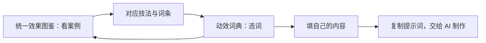

# 图鉴与词典的项目设计

日期：2026-10-01

**两个主项目，一条使用路径：看效果 → 找到描述 → 组合提示词。**

本页记录项目定位与下一步设计。文中的“待实施”表示已有设计、尚未改变运行中的页面或数据维护方式。

## 项目定位

| 项目 | 用户来这里做什么 | 主要交付 | 对外位置 |
| --- | --- | --- | --- |
| [统一效果图鉴](https://github.com/jinhanbuilds/opus-5-5-unified-gallery) | 浏览效果，找到值得参考的完整案例 | 可运行作品、完整提示词、技法与出处 | 主项目：看案例 |
| [动效词典](https://github.com/jinhanbuilds/motion-lexicon) | 学会描述效果，再组合自己的提示词 | 75 个关键词、10 套场景配方、中英文配方器 | 主项目：写提示词 |
| [22 条动效片库](https://github.com/jinhanbuilds/opus-5-5-motion-gallery) | 回看旧版精选案例与资料 | 旧版页面、22 个演示、提示词合集 | 历史版本与来源 |

仓库保留各自的历史、Issue 与地址。旧片库的 README 引导到两个主项目；其文件仍供统一图鉴的固定来源版本使用。

## 对外入口

两个主 README 使用同一组入口，按用户目的选择：

- **看案例、找灵感：** 统一效果图鉴。
- **学会描述、写提示词：** 动效词典。

GitHub 不增加第四个导航仓库。两个项目的介绍互相连接，旧片库说明它在系列中的历史位置。

页面导航的设计是：图鉴头部“去动效词典”，词典提供“看完整案例”；旧片库放在“来源与历史版本”中。

## 从案例走到自己的作品

**待实施：** 每条案例的“用这些词制作”传入相应词条编号。词典继续允许修改、删除词条；“查看案例”则回到关联作品，而不是只跳到图鉴首页。

当前图鉴的词典跳转使用既有在线词典链接。新的 GitHub 词典拥有完整本地包，尚未核对在线词典与本仓库的版本一致性；更新跨页面的词条映射前，应以当前 75 个词的编号为准。README 先链接可靠的仓库入口。

## 内容维护

**当前：** 统一图鉴固定引用 100 HTML 和 22 条片库两个来源子模块；词典随包携带 22 个示意演示。词典中的 22 个演示与旧片库当前文件逐个一致，但两边不是自动同步。

**待实施的目标：** 22 条案例的原始提示词、作者、来源、收录状态与演示，以来源片库的固定版本维护一次；词典按构建步骤取出一份可离线携带的快照。词典的关键词、讲解和场景配方在词典仓库维护，图鉴的中文索引与导航在图鉴仓库维护。

来源更新须明确更新固定版本、重建受影响的项目并核对演示。源码可以分仓库，案例事实保持一处维护，用户下载包仍可完整使用。

## 署名与使用范围

| 位置 | 放什么 |
| --- | --- |
| README | 一眼可见的制作署名与使用范围，链接详细说明 |
| `RIGHTS.md` | 本项目新增部分、第三方内容、依赖和媒体的使用边界 |
| `CREDITS.md` 或逐条来源 | 原作者、来源链接、原文／摘录与演示差异 |
| 页面页脚、视频简介 | 简短制作署名，链接详细来源与使用说明 |

建议的简短署名：

> 图鉴与词典由 AI伐木工（jinhan）整理、设计与维护。原作及提示词的归属见各条来源，使用范围见项目声明。

先记录现有权利与来源边界。新的开源许可须明确适用的原创部分，并分别处理第三方内容；本方案没有对第三方作品或宣传视频配乐作出授权承诺。

## 本次交付与后续顺序

1. **本次：** 两个主 README 加共同入口；旧片库加历史版本说明；三个仓库补制作署名、来源与使用说明。
2. **下一步：** 核对在线词典版本，更新案例与当前词条的映射，再完善页面之间的跳转。
3. **维护收口：** 实现 22 条案例快照的统一更新与校验；逐项补齐第三方许可与宣传配乐依据。

旧仓库本次保留正常可读取状态。若后续采用 GitHub Archive，先确定案例来源的维护位置与升级方式，保证现有子模块依赖可继续读取。
